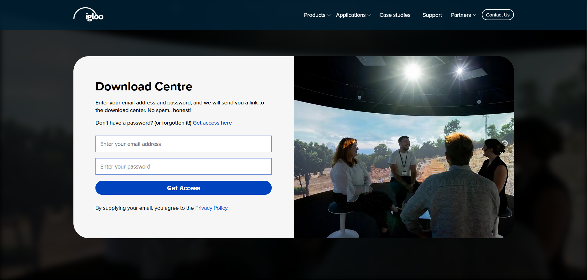
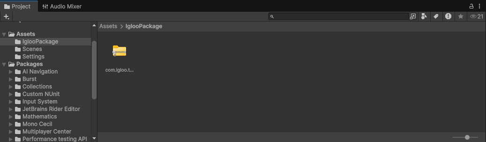
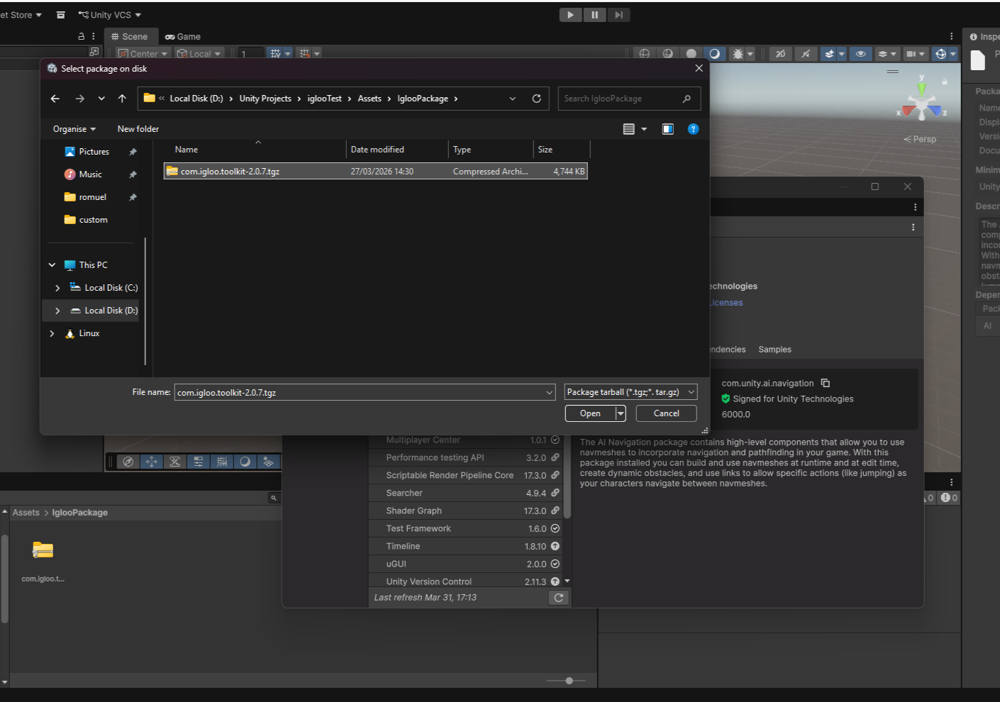
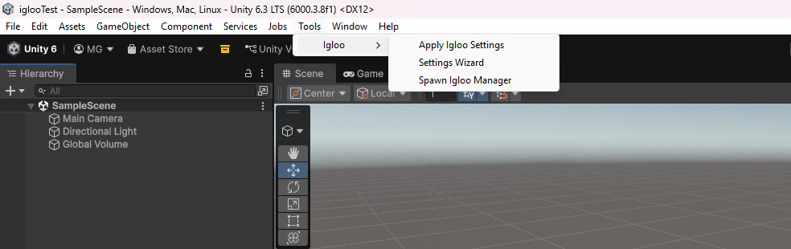
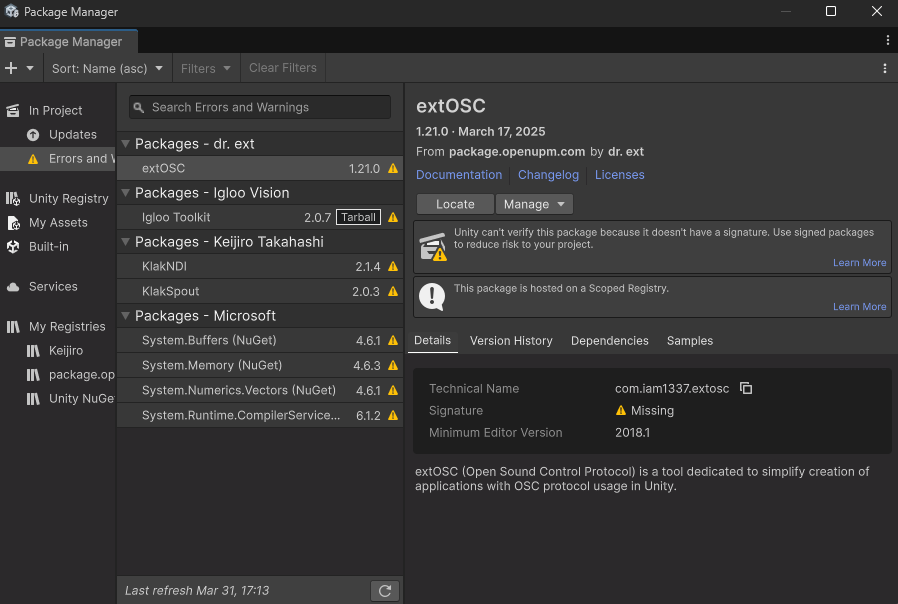
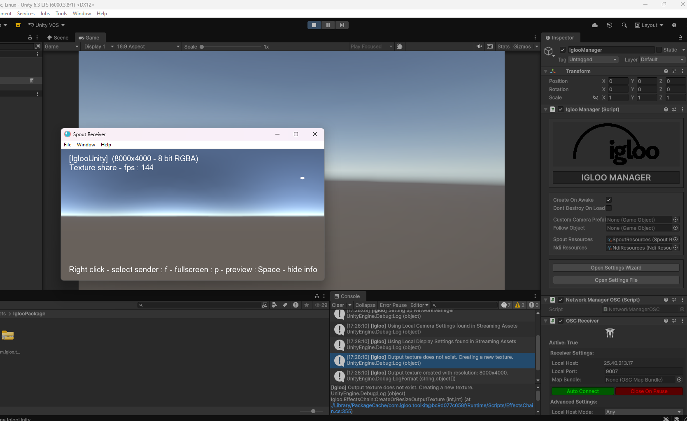

First, we need to go ahead and download the igloo vision unity package at [this address.](https://www.igloovision.com/downloadcentre/) 

I don't have knowledge on how to bypass the "required access" as I have a version downloaded from *before* they added this wall; hopefully, you can just sign up for an account, and it should work just fine.

Once you have the .tgz file installed, we want to simply make a blank 3D project inside of Unity. Then, you will want to put that .tgz package file into your project's directory, preferably, inside of it's own folder. An example is shown below:

**This won't actually install the package into your project, but it's still important.** This is down to how the Unity package manager handles *locally* installed packages: it looks for the directory of where the package is stored on the local device. This presents issues when you try and pull this project file from a Github repository for collaboration, as it only tries to look at that one specified filepath, which shouldn't return anything.

Doing this first step of actually including the package file *inside* of the project itself should prevent any issue when pulling on different devices, see [here for more info relating to this issue.](commonIssues/unresolvedFilepath.md)

Now, let's install the package. Head to the Unity package manager window, and click on the plus icon in the top left corner. **Select install package from tarball.**

It will state that "at least one package doesn't have a signature." **Ignore this; this is no issue, simply hit close.** It will take a moment to resolve these package files and install them. 

In the toolbar, head to Tools, where you will now find a bunch of different igloo options.

We first want to select "Apply Igloo Settings", and we want to **install all packages.** This will once again process for a moment before we can carry on. You'll probably get another warning about package signatures; ignore this!

As well as doing this, also open the igloo settings wizard; otherwise, the settings file doesn't get created and causes issues.

If you now take a look at your package manager, you should see this:

This is everything that you would need to get started working with the igloo room, but this **doesn't include player input.** For that, [see here.](howTo/howToImportPlayerInput.md) 
# Demo
Here is the demo for the initial setup:

